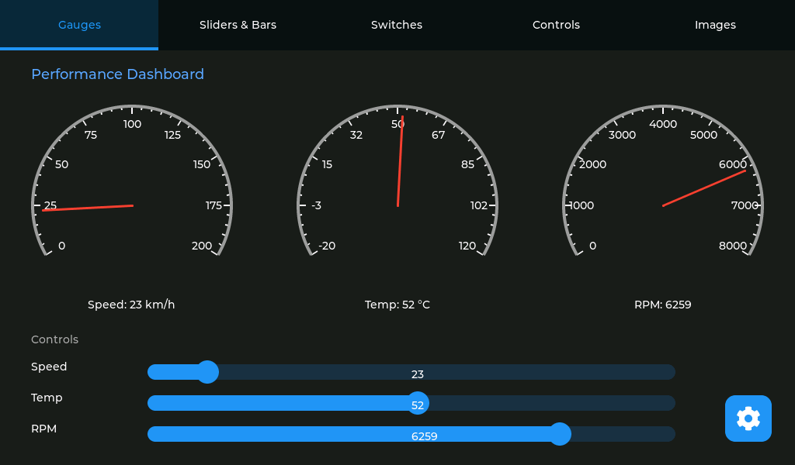

# FlexiHMI MQTT

A production-ready, MQTT-controlled dynamic Human-Machine Interface (HMI) system for the ESP32-P4-Function-EV-Board or JC1060WP470C_I_W_Y.
Features LVGL 9.3, real-time configuration updates, 14 widget types, and hardware-accelerated graphics.



## Key Features

- 🎨 **14 Widget Types**: Labels, Buttons, Switches, Sliders, Gauges, Images, and more
- 🔄 **Dynamic Configuration**: Update entire UI via MQTT JSON messages
- 📡 **Full MQTT Integration**: Bidirectional control for all interactive widgets
- 🖼️ **Advanced Image Support**: QOI images from SD card (when available) + base64 QOI over MQTT
- ⚡ **Hardware Acceleration**: ESP32-P4 PPA (Pixel Processing Accelerator) enabled
- 🎯 **Thread-Safe**: Async callbacks ensure safe LVGL operations
- 📱 **Touch Support**: Full capacitive touch integration
- 💾 **Large Message Support**: 512KB-1MB MQTT buffers for complex configurations

## Hardware

- **Board options**: ESP32-P4-Function-EV-Board 1.4 or JC1060WP470C_I_W_Y
- **Display**: 1024x600 MIPI DSI display (EK79007 on P4 EV, JD9165 on JC)
- **Touch**: GT911 capacitive touch controller
- **Storage**: SD card support on ESP32-P4-Function-EV-Board only (optional)
- **Connectivity**: WiFi + ESP32-C6 co-processor via ESP-Hosted (P4 EV default)

## Supported Widgets

1. **Label** - Text display with MQTT updates and formatting
2. **Button** - Interactive buttons publishing MQTT messages
3. **Container** - Layout containers for grouping widgets
4. **Switch** - Toggle switches with bidirectional MQTT control
5. **Slider** - Value sliders with real-time updates
6. **Arc** - Circular progress/value indicators
7. **Dropdown** - Selection menus publishing choices
8. **Checkbox** - Toggle checkboxes with MQTT sync
9. **Bar** - Progress bars for value visualization
10. **LED** - Status indicators with color customization
11. **Spinner** - Loading/activity indicators
12. **Tabview** - Multi-tab interfaces with per-tab widgets
13. **Gauge** - Analog-style circular gauges with needles
14. **Image** - Display images from SD card or base64 data via MQTT

See [docs/WIDGETS.md](docs/WIDGETS.md) for detailed specifications.

## Quick Start

### 1. Hardware Setup

1. Insert SD card (optional, P4 EV board only)
2. Connect the board via USB
3. Ensure ESP32-C6 is properly connected for WiFi

### 2. Build and Flash

```bash
# Set up ESP-IDF environment
get_idf

# Build and flash
idf.py build flash monitor
```

### Board Selection

Select the target board in menuconfig:

```bash
idf.py menuconfig
# Board Selection -> Target board -> ESP32-P4 Function EV Board or JC1060WP470C_I_W_Y
```

### 3. Connect to MQTT

The device will connect to your MQTT broker on boot. Configure WiFi/MQTT credentials in the settings UI (bottom right icon).

### 4. Load a Configuration

```bash
# Send a JSON configuration via MQTT
mosquitto_pub -h <broker_ip> -t "hmi/config" -f examples/json/interactive_complete_demo.json
```

## Project Structure

```
ESP32P4-MQTT-Panel/
├── main/
│   ├── main.c                  # C entry point, hardware init
│   └── main.cpp                # C++ main with HMI task
├── components/
│   ├── config_manager/         # JSON parsing and widget creation
│   ├── mqtt_manager/           # MQTT client with chunking support
│   ├── hmi_widgets/            # All 14 widget implementations
│   │   ├── label_widget.cpp
│   │   ├── button_widget.cpp
│   │   ├── gauge_widget.cpp
│   │   ├── image_widget.cpp    # SD + base64 support
│   │   └── ...
│   ├── ethernet/               # Ethernet support
│   ├── settings_ui/            # Configuration UI
│   └── status_info_ui/         # System status display
├── examples/
│   ├── json/                   # Example configurations
│   │   ├── README.md           # Configuration guide
│   │   ├── interactive_complete_demo.json
│   │   ├── gauge_demo.json
│   │   ├── image_example.json
│   │   └── ...
│   ├── images/                 # Sample images and conversion utility
│   │   └── convert.py           # Convert to QOI + base64
├── docs/
│   ├── WIDGETS.md              # Complete widget reference
│   └── INITIAL_SPEC.md         # Original specification
└── managed_components/          # ESP-IDF components (auto-downloaded)
    ├── lvgl__lvgl/             # LVGL 9.3.x
    └── ...
```

## Configuration System

### JSON Structure

```json
{
  "version": 1,
  "widgets": [
    {
      "type": "gauge",
      "id": "speed_gauge",
      "x": 50,
      "y": 60,
      "w": 200,
      "h": 200,
      "properties": {
        "min_value": 0,
        "max_value": 200,
        "value": 65,
        "mqtt_topic": "vehicle/speed"
      }
    }
  ]
}
```

### Dynamic Updates

Send new configurations anytime via MQTT:

```bash
# Update entire UI
mosquitto_pub -h broker -t "hmi/config" -f new_config.json

# Update individual widget values
mosquitto_pub -h broker -t "vehicle/speed" -m "85"
mosquitto_pub -h broker -t "demo/power" -m "true"
mosquitto_pub -h broker -t "demo/image1" -f image.qoi.base64.txt
```

## Advanced Features

### Image Widget

Load QOI images from SD card or receive base64-encoded QOI images via MQTT:

```bash
# SD card image (QOI, when SD card is available)
mosquitto_pub -t "demo/image" -m "/sdcard/logo.qoi"

# Base64 image (QOI)
python3 examples/images/convert.py photo.png photo.qoi
mosquitto_pub -t "demo/image" -f photo.qoi.base64.txt
```

Runtime supports QOI only. Base64 payloads must decode to QOI data.

### Hardware Acceleration

ESP32-P4's PPA (Pixel Processing Accelerator) is enabled for:
- Blending operations
- Color format conversions  
- Rotation and scaling
- Alpha blending

This significantly improves FPS, especially with multiple animated widgets.

### Thread Safety

All MQTT callbacks use LVGL's `lv_async_call()` to ensure thread-safe widget updates from the MQTT task context.

### Message Chunking

The MQTT manager automatically handles chunked messages up to 1MB, perfect for large configurations with base64 images.

## Examples

### Basic Examples (Learn Individual Widgets)

- `label_example.json` - Text display basics
- `button_example.json` - Interactive buttons
- `switch_example.json` - Toggle controls
- `slider_example.json` - Value adjustments
- `gauge_example.json` - Analog displays
- `image_example.json` - Image loading

### Advanced Examples

- `tabview_demo.json` - Multi-tab layouts
- `complete_demo.json` - All widgets showcase
- **`interactive_complete_demo.json`** - Production-ready dashboard (⭐ Recommended)

See [examples/json/README.md](examples/json/README.md) for detailed descriptions.

## MQTT Topics

| Topic | Purpose | Example |
|-------|---------|---------|
| `hmi/config` | Load new UI configuration | JSON file |
| `demo/speed` | Update gauge values | `"120"` |
| `demo/power` | Switch states | `"true"` / `"false"` |
| `demo/volume` | Slider positions | `"75"` |
| `demo/image1` | Image data | `/sdcard/pic.qoi` or base64 QOI |
| `demo/command` | Button commands | `"START"` |
| `demo/mode` | Dropdown selections | `"Auto"` |

## Display Configuration

- **Resolution**: 1024x600
- **Controller**: EK79007 (P4 EV) / JD9165 (JC)
- **Interface**: MIPI DSI (2 lanes @ 1000 Mbps)
- **Color Depth**: 16-bit RGB565
- **Refresh**: 60Hz with hardware acceleration
- **Touch**: GT911 (I2C, up to 10-point multitouch)
- **Backlight**: PWM-controlled via GPIO 26 (P4 EV) or GPIO 23 (JC)

## Building

### Prerequisites

- ESP-IDF v5.5.2 or later
- Python 3.8+
- MQTT broker (e.g., Mosquitto)

### Build Steps

```bash
# Clone repository
git clone <repository_url>
cd ESP32P4-MQTT-Panel

# Build
idf.py build

# Flash and monitor
idf.py flash monitor
```

### Configuration Options

Key options in `sdkconfig.defaults`:

```
# Performance
CONFIG_COMPILER_OPTIMIZATION_PERF=y
CONFIG_LV_USE_DRAW_PPA=y              # Hardware acceleration
CONFIG_LV_DRAW_PPA_BLEND=y

# MQTT
CONFIG_MQTT_BUFFER_SIZE=524288         # 512KB buffer

# Images
CONFIG_LV_USE_FS_POSIX=y              # SD card support (P4 EV board)
```

## Utilities

### Image Encoding

```bash
# Encode image to QOI + base64
cd examples/images
python3 convert.py image.png image.qoi

# Output saved to image.qoi.base64.txt
# Send via MQTT
mosquitto_pub -t demo/image -f image.qoi.base64.txt
```

### Configuration Validation

Validate JSON before sending:

```bash
# Check syntax
python3 -m json.tool config.json

# Estimate size
ls -lh config.json
```

## Troubleshooting

### Configuration Not Loading

- Check JSON syntax with validator
- Verify MQTT broker connection
- Confirm topic is `hmi/config`
- Check serial monitor for parse errors

### MQTT Messages Not Received

- Test broker: `mosquitto_sub -h <broker> -t "#" -v`
- Check QoS settings (use 0 or 1)
- Verify topic names match JSON configuration
- For large messages, check buffer sizes

## Documentation

- [WIDGETS.md](docs/WIDGETS.md) - Complete widget API reference
- [examples/json/README.md](examples/json/README.md) - Configuration examples guide

## Performance

- **Boot time**: ~3-5 seconds to display
- **Config load**: <1 second for typical configurations
- **FPS**: 30-60 FPS with PPA acceleration
- **Touch latency**: <50ms
- **MQTT latency**: <100ms for updates
- **Max config size**: 512kb
- **Max base64 image**: ~100KB recommended

## License

**Copyright © 2026 Spas Hristov. All Rights Reserved.**

### Terms of Use

**Personal and Educational Use**: This software is free to use for personal, educational, and non-commercial purposes.

**Commercial Use**: Any commercial use, including but not limited to:
- Integration into commercial products or services
- Use in business operations or environments
- Redistribution as part of commercial offerings
- Consulting or contracting work for compensation

requires prior written permission from the copyright holder.

**Attribution**: You must give appropriate credit, provide a link to this repository, and indicate if changes were made.

**No Warranty**: This software is provided "AS IS", without warranty of any kind, express or implied, including but not limited to warranties of merchantability, fitness for a particular purpose, and non-infringement.

**Contact**: For commercial licensing inquiries, please contact Spas Hristov.

## Credits

- ESP-IDF and LVGL teams
- ESP32-P4-Function-EV-Board BSP contributors
- MQTT community

## Support

For issues and questions:
- Check documentation in `docs/` and `examples/`  
- Review example configurations in `examples/json/`
- Check serial monitor output for error messages
- Validate JSON syntax before sending
